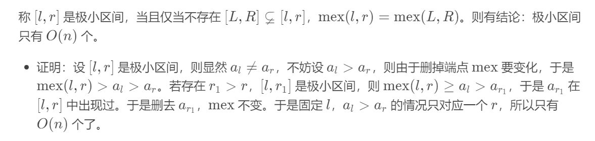

# 2023

## 2023.12

### 2023.12.25

### [G2. Light Bulbs (Hard Version)](https://codeforces.com/contest/1914/problem/G2)

若干个区间的极小并，当且仅当这个区间包含了所有区间，当且仅当每个区间的左右点出现了一次， 相当于某个标号恰好出现两次，可以用随机数来异或。

#### 因数个数小trick

$$
d(n)\%2=[n=k^2]
$$

当且仅当该数是完全平方数时，因数个数是奇数个

#### 极小mex

